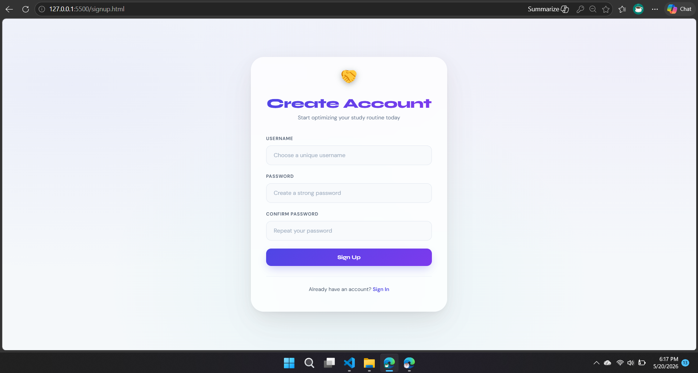
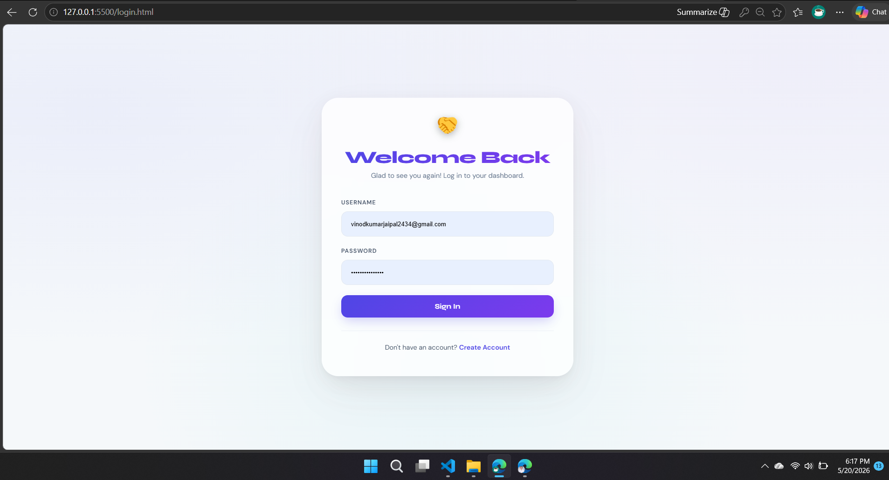
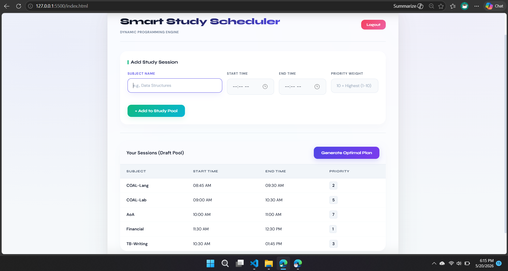
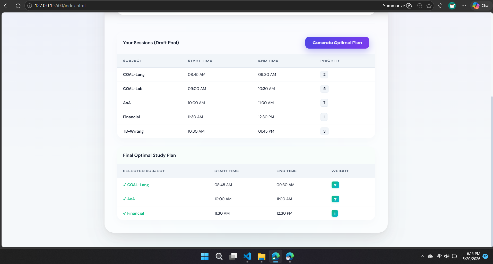

# Smart Study Scheduler 📚⏱️

An advanced, high-performance web application designed to help students generate optimal, non-overlapping study schedules. This project was developed as a core laboratory project for the **Analysis of Algorithms (AoA)** course in the **4th Semester of Software Engineering**.

The system maps the problem of overlapping study slots with varying importance to the classic **Weighted Interval Scheduling Problem**, solving it efficiently using **Dynamic Programming** and **Binary Search** to bypass inefficient brute-force approaches.

---

##  Core Algorithmic Engineering (AoA Perspective)

Unlike the standard *Interval Scheduling Problem* which can be solved using a Greedy approach (sorting by finish times to maximize the count), this project deals with **Priorities (Weights)**. Because academic subjects hold different credits or urgency, a Greedy choice does not yield an optimal solution. 

### Mathematical Formulation & Optimization

1. **Sorting Phase:** The input study sessions are sorted chronologically based on their end times.
2. **Dynamic Programming Lookup:** We define a DP array `dp[]` where `dp[i]` stores the maximum achievable priority using the first `i` sessions.
3. **Binary Search Acceleration:** To find the latest non-overlapping session before the current one, a standard candidate-assignment Binary Search is implemented instead of a linear search. This drops the step complexity from $O(n)$ to $O(\log n)$.
4. **Backtracking:** Once the maximum weight is calculated at `dp[n]`, the engine backtracks to extract the exact chronological path of selected sessions.

### Complexity Analysis

| Metric | Naive/Brute-Force Approach | Our DP + Binary Search Implementation |
| :--- | :--- | :--- |
| **Time Complexity** | $O(n^2)$ or $O(2^n)$ | **$O(n \log n)$** |
| **Space Complexity** | $O(n)$ | **$O(n)$** |

---

## ✨ Features

* **Zero-Dependency Backend:** Built natively on Java's core lightweight `HttpServer` without heavy frameworks (like Spring Boot), ensuring instantaneous startup and low memory footprint.
* **High-Performance JSON Parser:** Bypasses reflection-heavy libraries (like Jackson/Gson) by utilizing highly optimized native Regex tokenizers for processing network payloads.
* **Optimal Schedule Generation:** Solves multi-variant resource conflicts seamlessly.
* **Secure Authentication Layer:** Micro-storage implementation for User Signups and Logins with synchronized multi-threaded file persistence.
* **Full CORS Capability:** Ready to handle pre-flight `OPTIONS` routing securely.

---

## 🛠️ Tech Stack

* **Frontend:** HTML5, CSS3 (Modern Glassmorphic UI), Vanilla JavaScript (Fetch API)
* **Backend:** Java 17+ (Core Networking & Concurrency Utilities)
* **Database:** Flat File Architecture (`users.txt` with synchronized data stream layers)

---

## 📸 Interface & Visual Walkthrough

### 1. Authentication Portal
Secure entryway allowing students to isolate and persist their dedicated study configurations.

| Sign Up Page | Login Page |
| :---: | :---: |
|  |  |

### 2. Schedule Optimization Engine
The core visualization of the Analysis of Algorithms project in action. 

#### Unoptimized Scheduling State (Before Algorithm Execution)
Students input overlapping exams and study routines, showing messy timeline clashes.

#### Optimized Scheduling State (After Dynamic Programming Execution)
The algorithm instantly processes the schedule, eliminates all overlapping blocks, and serves the maximum priority roadmap.

---

## 💻 How to Run the Project Locally

### Prerequisites
* Java Development Kit (JDK 17 or higher)
* A modern web browser

### Steps to Run

1. **Clone the repository:**

   
   git clone [https://github.com/vinodkumarjaipal/smart-study-scheduler.git](https://github.com/vinodkumarjaipal/smart-study-scheduler.git)
   cd smart-study-scheduler

2. **Compile and Run the Backend Server:**
Locate your main Java application file and execute:

javac Main.java
java Main

*The console will display: `Advanced AoA Backend Server running on port 8080*`
3. **Launch the Frontend:**
Simply open the `login.html` or `index.html` file in any modern browser to interact with the system.

## 👤 Author

* **Vinod Kumar Jaipal** - [GitHub Profile](https://github.com/vinodkumarjaipal)
* **Course:** Software Engineering (4th Semester)
* **Subject:** Analysis of Algorithms (AoA)
